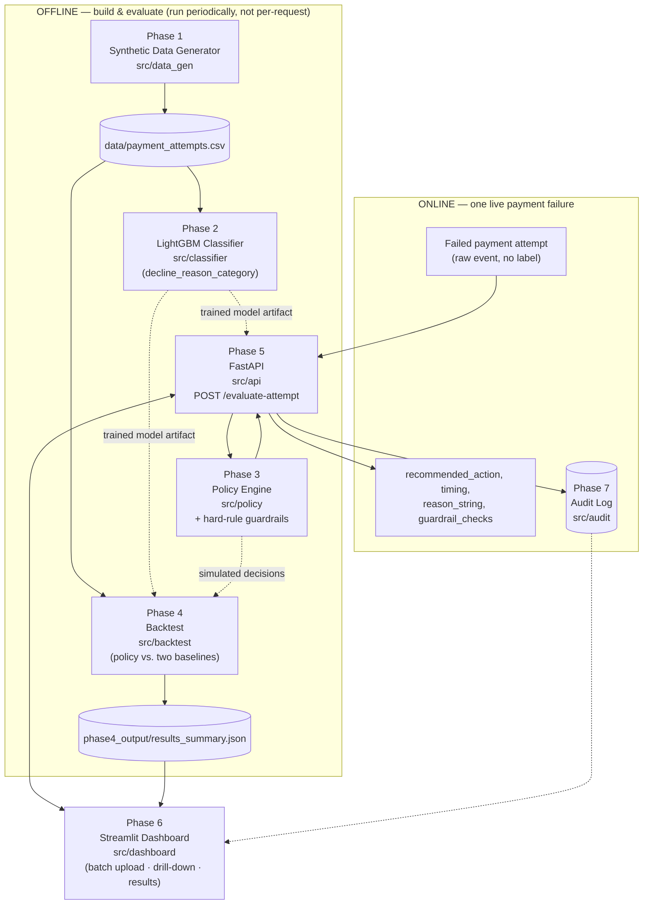

# Payment Retry Sequencer

**A defensive-first retry decision engine for failed payments.** It reads a raw,
noisy bank decline code, classifies the true underlying reason, and recommends
a safe retry action — while a rule enforced *outside* the ML model guarantees
that fraud-blocked or expired-card transactions can never be silently retried.

> ⚠️ **Scope & disclaimer:** This project runs on fully synthetic data (see
> [`docs/assumptions.md`](docs/assumptions.md)). No real transactions, cardholders,
> or bank data are involved. It's a portfolio/prototype system, not a certified
> production payment processor.

---

## The problem

When a payment fails, the bank hands back a raw response code that's often
ambiguous or inconsistent across banks and gateways. Two very different
situations — "your card was blocked for fraud" and "your card had a network
hiccup" — can arrive looking almost identical on the wire. Retry the wrong one
blindly and you either:

- **waste money and annoy customers** retrying something that was never going
  to succeed, or
- **worse: retry a transaction a fraud system deliberately blocked.**

Most naive retry logic picks one of two bad defaults: retry everything (fast
but dangerous) or retry nothing (safe but leaves real recoverable revenue on
the table). This project tries to do neither.

## What it does

Given a failed payment attempt, it returns a specific recommended action
(`same_gateway_retry`, `alt_gateway_retry`, `alt_payment_method_prompt`,
`delayed_retry`, or `no_retry`), a timing hint, a confidence score, a
human-readable reason, and a list of every guardrail check that ran — in
under a second, with every decision written to an audit log.

## Headline result (Phase 4 backtest, 6,003 synthetic failed attempts)

| Scenario | Net revenue recovered | % of at-risk value | Recovery rate |
|---|---|---|---|
| Do nothing | ₹0 | 0% | — |
| Retry everything, blindly | ₹2,793,089 | 25.8% | 26.8% |
| **This policy engine** | **₹5,334,298** | **49.4%** | **60.8%** |

**₹2.54M more net revenue recovered than blindly retrying every failure** —
and that advantage holds within a ₹20K band across a 4x swing in gateway-fee
and customer-annoyance cost assumptions (see the sensitivity analysis in the
dashboard's Results tab), so it isn't an artifact of one arbitrary cost model.

**The safety number that matters more than the revenue number:** the
underlying ML classifier, on its own, misclassified 13 of 957 true
`risk_block`/`card_expired` cases as something else. **Zero of those 13
reached a customer as an actual retry recommendation.** The policy engine's
hard-stop rule doesn't trust the classifier's category call alone, so it
caught all 13 anyway. Full numbers in
[`phase4_output/results_summary.json`](phase4_output/results_summary.json).

## Architecture



**Why the classifier and the guardrail are separate boxes, on purpose:** the
classifier's job is only to guess the true decline reason from a noisy code —
it's allowed to be wrong sometimes. The `risk_block`/`card_expired` →
`no_retry` mapping is a hard rule that lives in the policy engine
(`src/policy/retry_policy_engine.py`), not a learned preference, specifically
so a bad retrain of the classifier can never quietly weaken it. The
0-violations result above is that design decision actually paying off, not
luck.

### Phase-by-phase

| Phase | What it is | Where |
|---|---|---|
| 1 | Synthetic data generator — 3 merchant archetypes, calibrated decline-reason distributions, time-of-day/month-end effects, ground-truth retry-recoverability labels | `src/data_gen/data_gen.py` → `data/payment_attempts.csv` |
| 2 | LightGBM multiclass classifier, time-based train/val/test split, class-imbalance handling, SHAP explainability | `src/classifier/train_classifier.py` → artifacts in `docs/phase2_plots/` (`decline_reason_classifier.txt`, `confusion_matrix.png`, `shap_*.png`, `results.json`); write-up in `docs/phase2_results.md` |
| 3 | Policy engine: ML/heuristic action scoring + guardrails, including the hard `no_retry` rule | `src/policy/retry_policy_engine.py` |
| 4 | Backtest: policy vs. "do nothing" vs. "retry everything," false-positive/over-block analysis, cost-sensitivity sweep | `src/backtest/build_phase2_features.py`, `src/backtest/score_with_phase2_model.py`, `src/backtest/run_backtest.py` → `phase4_output/results_summary.json`, `phase4_output/audit_trail.csv`; write-up in `phase4_output/phase4_report.md` |
| 5 | FastAPI service — `POST /evaluate-attempt`, `GET /health`, JSONL audit logging, OpenAPI docs | `src/api/main.py`, `src/api/feature_engineering.py` |
| 6 | Streamlit ops dashboard — batch upload, per-attempt audit drill-down, results charts | `src/dashboard/app.py` |
| 7 | Audit trail — every API request/response pair, JSON-lines, feeds the dashboard's drill-down, plus dedicated guardrail enforcement + tests | `src/audit/audit_log.py`, `src/audit/guardrail_enforcement.py`, `src/audit/test_guardrails.py` (run via root `conftest.py`), `src/audit/demo.py` |

## Repository layout

```
payment-retry-sequencer/
├── README.md
├── docs/
│   ├── schema.md                  # canonical data schema + decline-reason / retry-action taxonomies
│   ├── schema.json                # machine-readable version of the schema above
│   ├── phase2_results.md          # Phase 2 classifier evaluation write-up
│   ├── phase2_plots/              # decline_reason_classifier.txt, confusion_matrix.png, shap_*.png, results.json
│   ├── compliance_notes.md
│   ├── assumptions.md             # Phase 1 calibration sources & assumptions
│   ├── video_script.md
│   └── submission_checklist.md
├── src/
│   ├── data_gen/
│   │   └── data_gen.py
│   ├── classifier/
│   │   └── train_classifier.py
│   ├── policy/
│   │   └── retry_policy_engine.py
│   ├── backtest/
│   │   ├── build_phase2_features.py
│   │   ├── score_with_phase2_model.py
│   │   └── run_backtest.py
│   ├── api/
│   │   ├── main.py
│   │   └── feature_engineering.py
│   ├── dashboard/
│   │   └── app.py
│   └── audit/
│       ├── audit_log.py
│       ├── guardrail_enforcement.py
│       ├── test_guardrails.py
│       └── demo.py
├── data/
│   └── payment_attempts.csv
├── phase4_output/                 # phase4_report.md, results_summary.json, audit_trail.csv
├── audit_log.jsonl                # runtime-generated JSONL audit log written by src/audit/audit_log.py
├── demo_audit_log.jsonl           # runtime-generated JSONL audit log written by src/audit/demo.py
├── requirements_phase6.txt        # pip requirements for the Streamlit dashboard
└── conftest.py
```

## Setup

Every command below runs **from the project root** — none of the scripts
are meant to be run from inside their own subfolder. They import sibling
modules directly (e.g. `src/api/main.py` does `import retry_policy_engine`
and `import feature_engineering`, not fully-qualified package imports), so
those sibling folders have to be on `PYTHONPATH`, not just the repo root
itself.

```bash
git clone <your-repo-url>
cd payment-retry-sequencer
python -m venv .venv && source .venv/bin/activate   # or your preferred env tool

export PYTHONPATH="src/data_gen:src/classifier:src/policy:src/backtest:src/api:src/dashboard:src/audit"
```

> **Both of these lines are per-terminal-session state, not one-time setup.**
> `source .venv/bin/activate` and `export PYTHONPATH=...` only apply to the
> shell process you ran them in. Open a new terminal tab or window — to run
> the API and the dashboard side by side, for instance — and neither one
> carries over; you have to re-run both in that new tab before anything
> below will work there. Forgetting this is the single most common cause of
> `ModuleNotFoundError` when following these steps.

**1. Generate synthetic data**
```bash
pip install pandas numpy
python src/data_gen/data_gen.py
# -> data/payment_attempts.csv
```

**2. Train the classifier**
```bash
pip install lightgbm shap pandas numpy scikit-learn matplotlib
python src/classifier/train_classifier.py
# -> docs/phase2_plots/decline_reason_classifier.txt, confusion_matrix.png, shap plots, results.json
```

**3. Build features, score, and run the backtest**
```bash
pip install lightgbm pandas numpy
python src/backtest/build_phase2_features.py --save-artifacts  # turns raw attempts into the Phase 2 model's feature set
python src/backtest/score_with_phase2_model.py                 # scores every attempt with the trained classifier
python src/backtest/run_backtest.py                            # policy vs. "do nothing" vs. "retry everything" — imports retry_policy_engine directly
# -> phase4_output/results_summary.json, audit_trail.csv
# -> data/phase2_split_artifacts.json (bucket-edge artifacts — needed by the API in step 4, see below)
```
The `--save-artifacts` flag matters beyond this step: it's what writes
`data/phase2_split_artifacts.json`, and the API in step 4 won't start
without that file.

**4. Start the API**
```bash
pip install fastapi uvicorn pydantic pandas lightgbm
AMOUNT_BUCKET_ARTIFACTS_PATH=data/phase2_split_artifacts.json uvicorn src.api.main:app --reload
# -> docs at http://localhost:8000/docs
```
Two things to know about this command:
- `src.api.main:app` — not `main:app` — because uvicorn imports the app
  object as a module path relative to wherever you run the command; it
  doesn't `cd` into `src/api` for you.
- `AMOUNT_BUCKET_ARTIFACTS_PATH` is required, not optional — the API
  refuses to start without it. It points to the bucket-edge artifacts
  saved by step 3's `build_phase2_features.py --save-artifacts`, which the
  API needs to bucket a live transaction's amount the same way the
  classifier's training data was bucketed. If you skipped `--save-artifacts`
  in step 3, run it now before starting the API.

Add `--host 0.0.0.0 --port 8000` if you need it reachable outside
localhost.

**5. Start the dashboard**
```bash
pip install streamlit pandas requests
streamlit run src/dashboard/app.py
# -> http://localhost:8501 (talks to the API at http://localhost:8000)
```

**6. Run the guardrail tests**
```bash
pip install pytest
pytest src/audit/test_guardrails.py
```
This one doesn't actually need the exported `PYTHONPATH` — the root
`conftest.py` already does the equivalent sys.path setup, but only for
things pytest collects. Running the demo script directly still relies on
the export from above:
```bash
python src/audit/demo.py
# scripted walkthrough of the guardrail logic against a handful of sample attempts
```

## Assumptions & limitations

This section is deliberately specific rather than reassuring — full detail in
`docs/assumptions.md` and `docs/phase2_results.md`.

- **Data is synthetic and calibrated, not real.** UPI technical/business
  decline-rate targets are sourced from NPCI's public statements (OC-149
  circular; MD remarks, Nov 2024); domestic card decline rates and the exact
  per-category reason splits are my own estimates, not published figures —
  flagged explicitly in `docs/assumptions.md` as the weakest-sourced numbers.
- **The classifier is not perfect, and the README doesn't pretend it is.** Test
  accuracy is ~87.7% (macro F1 0.872). Rare classes (`card_expired` n=62,
  `other` n=51 in the held-out test split) have thin support and real sampling
  noise in their per-class metrics.
- **The classifier alone has a measurable dangerous failure mode**: ~3.6% of
  true `risk_block` cases and ~3.2% of true `card_expired` cases were
  misclassified into a retryable category on the Phase 2 test set (13/957 on
  the full Phase 4 backtest population). This is exactly why the hard rule
  lives outside the model — see "Lessons learned" below.
- **Wasted retries are real, not zero.** The policy still attempts a retry on
  63.3% of the population that was truly unrecoverable per ground truth — the
  net cost of that (₹7,281) is small relative to gross recovery, but it isn't
  nothing, and a production system would want tighter recovery-probability
  calibration before trusting these thresholds directly.
- **Over-blocking has a cost too.** 75 attempts were over-cautiously blocked,
  forgoing an estimated ₹75,844 in recoverable revenue — the flip side of a
  conservative guardrail design.
- **Historical rolling features (merchant/customer/gateway failure rates) are
  caller-supplied in the current API**, not computed from a live feature
  store — there isn't one built yet. Phase 6's dashboard sources them from the
  uploaded CSV; a real deployment would need an actual feature-serving layer.
- **Gateway maintenance windows were deliberately not hardcoded** as a
  classifier feature, even though the synthetic generator's config defines
  them exactly — that would mean the model peeking at its own generator's
  internals rather than learning gateway degradation from observed behavior.

## Lessons learned

See `docs/submission_checklist.md` and `docs/video_script.md` for the "what
broke" narrative used in the pitch: the Phase 2 classifier's 13 missed
hard-stop cases, and why the fix was an independent guardrail
(`src/policy/retry_policy_engine.py`, exercised by
`src/audit/test_guardrails.py`) rather than a better model.
